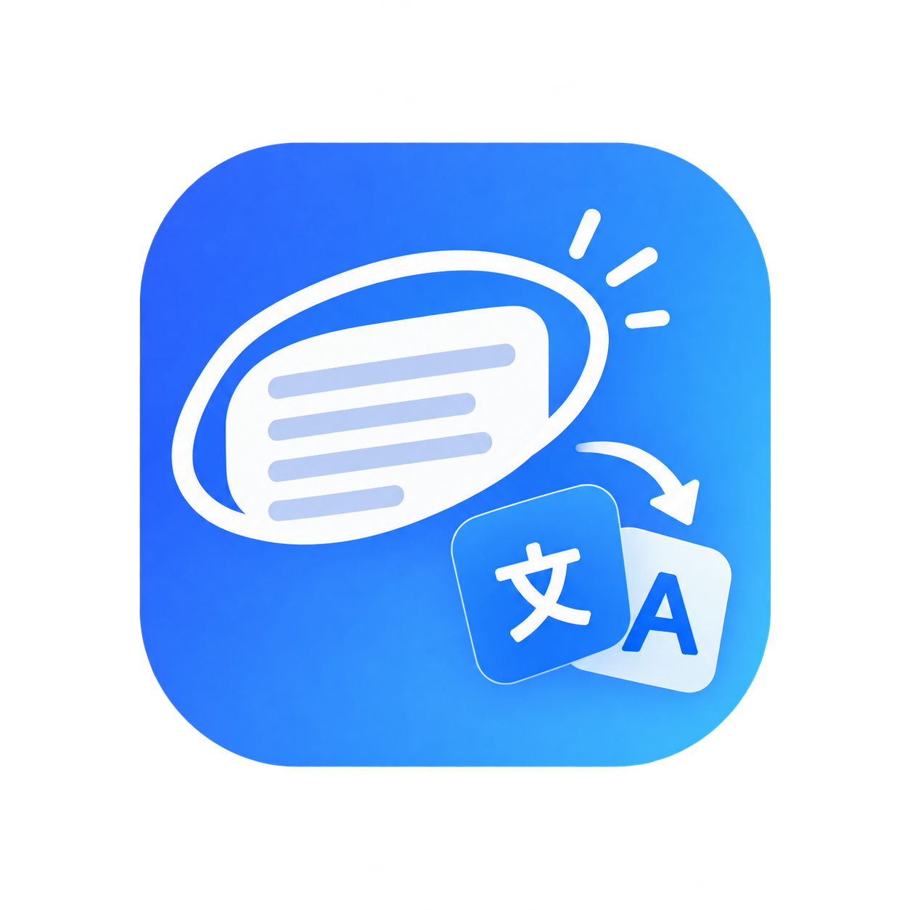
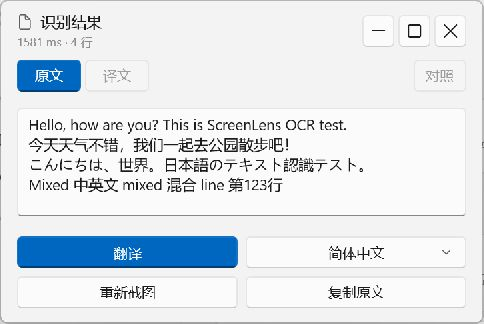
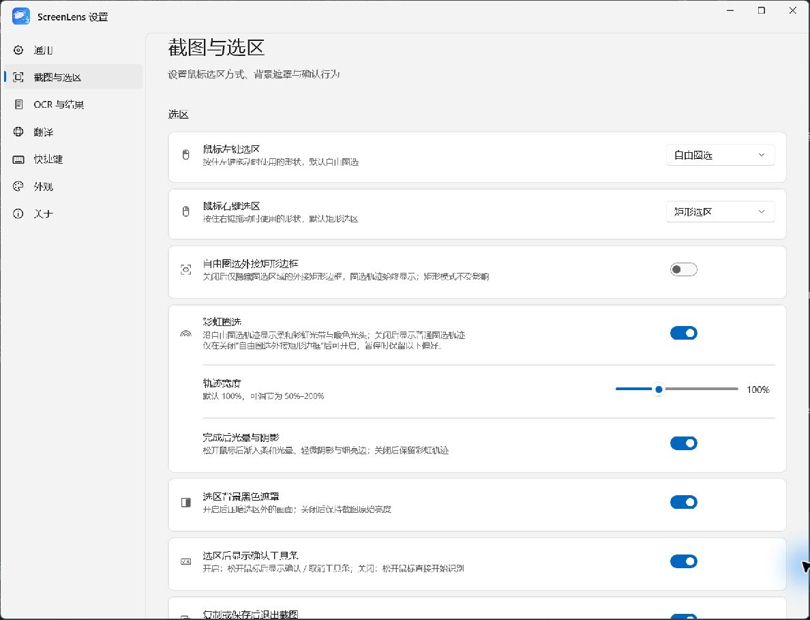
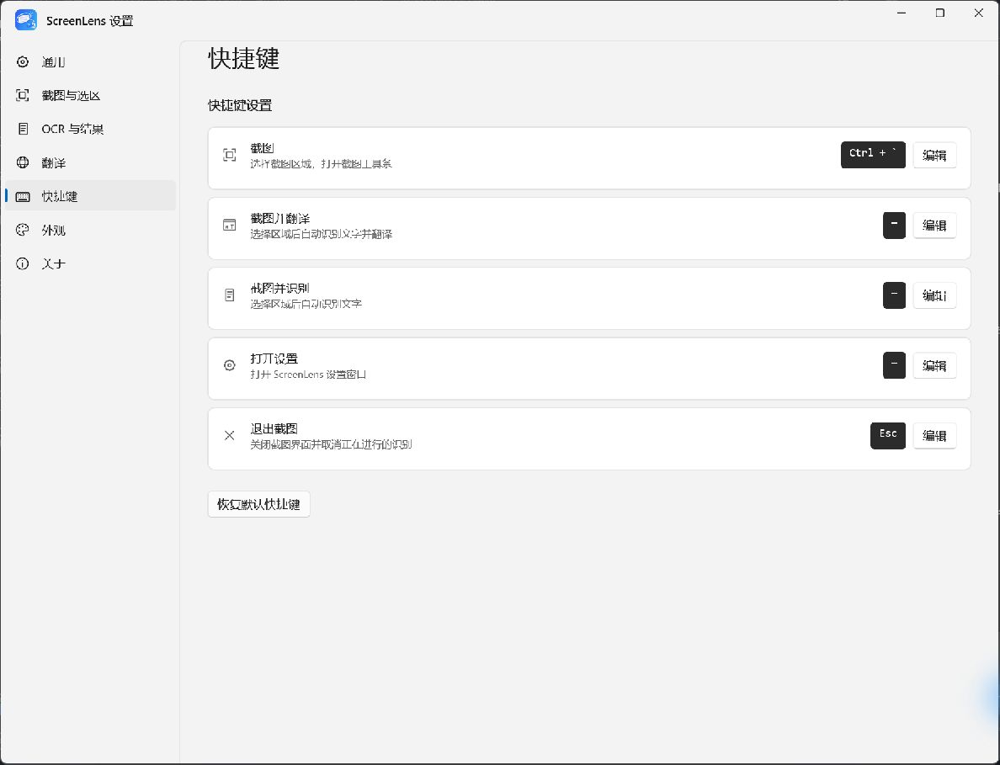
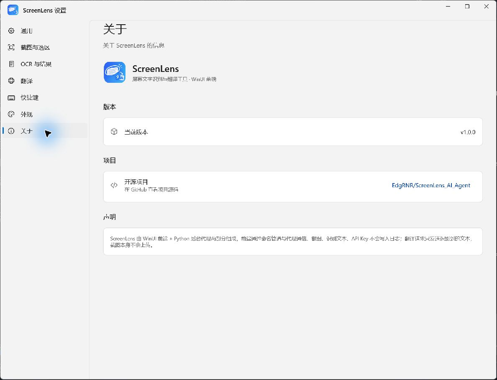

<p align="center">
  
</p>

<h1 align="center">ScreenLens</h1>

<p align="center">自由圈选屏幕内容，本地识别文字，按需复制或翻译。</p>
<p align="center"><strong>v1.0.0 · Windows x64 · WinUI 3 · 离线 OCR</strong></p>

ScreenLens 是一款 Windows 桌面截图、文字识别与翻译工具。通过全局快捷键呼出截图界面，使用自由圈选或矩形选区获取内容，再选择复制图像、保存图像或识别文字。识别在本机完成，翻译按需连接所选在线服务。

后台托盘负责快捷键和任务调度，设置、截图和结果窗口按需打开；OCR worker 在任务开始时启动，空闲 30 秒后回收。

## 目录

- [功能](#功能)
- [软件截图](#软件截图)
- [快速开始](#快速开始)
- [使用说明](#使用说明)
- [翻译配置](#翻译配置)
- [从源码运行](#从源码运行)
- [构建免安装包](#构建免安装包)
- [架构与项目结构](#架构与项目结构)
- [配置与隐私](#配置与隐私)
- [测试](#测试)
- [常见问题](#常见问题)
- [反馈与贡献](#反馈与贡献)
- [许可证与第三方组件](#许可证与第三方组件)

## 功能

| 功能 | 说明 |
| --- | --- |
| 自由圈选与矩形截图 | 默认左键自由圈选、右键矩形选区，两种按键映射均可自定义 |
| 彩虹圈选 | 可开关彩虹轨迹，调整宽度，选择完成后的光晕与阴影效果 |
| 截图交互设置 | 自由圈选外接矩形边框、背景黑色遮罩、松开鼠标后的确认行为均可设置 |
| 图像复制与保存 | 从选区工具条复制图像到剪贴板，或选择路径保存图像 |
| 本地文字识别 | RapidOCR / PP-OCR 模型与 ONNX Runtime CPU 推理，支持中文、英文、日文及混合文本 |
| 结果阅读 | 窗口尺寸随文本内容调整，可缩放、最大化；支持原文、译文切换及宽窗口下左右对照 |
| 在线翻译 | Google 免费接口和 OpenAI 兼容服务；兼容接口支持流式显示、连接测试和模型列表获取 |
| 临时目标语言 | 结果窗口可单独选择本次翻译语言，不改变设置中的默认目标语言 |
| 可自定义快捷键 | 截图、截图并识别、截图并翻译、打开设置及退出截图 |
| 多显示器 | 选区界面覆盖多屏，工具条与结果窗口按屏幕范围定位 |
| 系统托盘与启动设置 | 当前用户登录时自动启动，以及启动时仅显示托盘 |
| 外观 | 跟随系统、浅色、深色主题，以及舒适 / 紧凑卡片密度 |

## 软件截图

以下为实际运行的 WinUI v1.0.0 界面截图。OCR 示例来自仓库中的[中英日测试图片](tests/data/ocr_test.png)，由本地 C# OCR worker 实际识别。

### 识别结果

结果窗口展示识别文字，可复制原文、选择本次翻译语言或重新截图。翻译后可切换原文与译文，拉宽窗口后可使用左右对照。



### 截图与彩虹圈选设置

分别设置左右键选区方式，并调整彩虹轨迹、完成后光晕与阴影、背景遮罩和确认工具条。



### 快捷键设置

为不同操作录入快捷键，也可恢复默认配置。



### 关于

查看当前版本，通过仓库链接访问项目源码。



## 快速开始

### 使用免安装包

当前提供 Windows x64 免安装包的构建流程，仓库尚未发布 GitHub Releases。现阶段可使用项目构建出的 ZIP，或按[从源码运行](#从源码运行)启动。

拿到免安装 ZIP 后：

1. 将整个压缩包解压到一个固定目录。
2. 双击 `ScreenLens.WinUI.exe` 打开设置；前端会连接或启动同目录的后台 Agent。
3. 使用默认快捷键 **Ctrl + 反引号（`）** 开始截图。
4. 仅需后台托盘时，可以直接运行 `ScreenLensAgent.exe`。
5. 从托盘菜单选择“退出”，关闭后台程序。

免安装包自带 Python、.NET、Windows App SDK 运行库和离线 OCR 模型，目标设备无需另装 Python 或 .NET。请保留完整目录结构，不要只复制单个 EXE，也不要直接在 ZIP 内运行。

开发版与免安装版使用同一套用户配置。测试免安装包前，请退出开发版 Run Agent 和已打开的 ScreenLens 窗口，避免连接到旧进程。

### 运行环境

- Windows 10 1809（build 17763）及以上 / Windows 11，x64。
- 图像复制与保存、本地 OCR 不需要网络。
- 翻译需要网络，以及所选服务要求的连接参数。
- 当前界面语言为简体中文。

## 使用说明

### 截图、复制与保存

1. 按截图快捷键，或从托盘菜单启动截图。
2. 使用左键自由圈选，或使用右键拖出矩形；按键映射可在“截图与选区”中修改。
3. 形成选区后，使用浮动工具条识别、复制图像、保存图像、重新选择或取消。
4. 鼠标悬停在工具条图标上，可查看功能名称与快捷键。

| 截图界面操作 | 默认按键 |
| --- | --- |
| 识别当前选区 | Enter |
| 复制选区图像 | Ctrl + C |
| 保存选区图像 | Ctrl + S |
| 取消截图 / 取消正在进行的识别 | Esc |

“选区后显示确认工具条”关闭时，松开鼠标将直接开始识别。“复制或保存后退出截图”默认开启，成功后先关闭截图界面，再显示提示。

### 彩虹圈选

彩虹效果仅用于自由圈选，需先关闭“自由圈选外接矩形边框”才能开启。关闭外接矩形边框不会隐藏自由圈选轨迹。

- **彩虹圈选**：控制彩虹轨迹效果。
- **轨迹宽度**：默认 100%，范围为 50%–200%。
- **完成后光晕与阴影**：松开鼠标后渐入增强效果，可独立关闭。

背景黑色遮罩与彩虹效果可分别设置；矩形选区不使用彩虹轨迹。

### 识别与翻译结果

识别后在结果窗口阅读或复制原文。点击“翻译”使用当前配置的服务；右侧语言下拉框只影响本次结果，初始值来自设置中的默认目标语言。

长文本可滚动阅读。窗口较窄时通过“原文 / 译文”切换；窗口足够宽且已有译文时，可以开启“对照”。结果面板位置与文字大小可在“OCR 与结果”中设置。

### 全局快捷键

| 操作 | 默认配置 |
| --- | --- |
| 截图 | Ctrl + 反引号（`） |
| 截图并识别 | 未绑定，可在设置中录入 |
| 截图并翻译 | 未绑定，可在设置中录入 |
| 打开设置 | 未绑定，可在设置中录入 |
| 退出截图 | Esc |

“截图并识别”在选区完成后自动识别；“截图并翻译”继续执行翻译。普通截图则按当前确认工具条设置操作。

## 翻译配置

从托盘打开设置，进入“翻译”页：

| 服务 | 需要填写的内容 | 特点 |
| --- | --- | --- |
| Google 免费 | 无需 API Key | 需要网络；接口可用性受网络及服务变化影响 |
| OpenAI 兼容 | API 地址、API Key、模型 | 使用兼容服务商或自行部署的兼容接口 |
| 关闭翻译 | 无 | 仅截图、保存、复制和本地识别 |

使用 OpenAI 兼容服务时：

1. 填写服务商提供的 API 地址，例如 `https://api.openai.com/v1`。
2. 填写该服务的 API Key。
3. 输入模型名称，或点击“获取模型”查询接口提供的模型列表。
4. 使用“测试连接”确认配置可用，再点击“保存并启用”。

不同服务商的地址与模型命名可能不同，请以其说明为准。模型列表取决于服务是否实现兼容的模型查询接口；列表不可用时仍可手动填写模型。

默认翻译目标支持简体中文、英语和日语。OpenAI 兼容翻译会逐步显示流式文本；请求失败会显示错误提示。

## 从源码运行

以下命令在 Windows PowerShell 中执行。

### 开发依赖

- Git。
- x64 Python；当前开发环境使用 Python 3.13。
- .NET 8 SDK。
- Windows SDK 与 WinUI / .NET 桌面构建工具，可通过 Visual Studio 2022 或对应 Build Tools 安装。
- 首次安装依赖、还原 NuGet 包需要网络。

### 1. 获取代码并安装 Python 依赖

```powershell
git clone https://github.com/EdgRNR/ScreenLens_AI_Agent.git
cd ScreenLens_AI_Agent

py -3 -m venv .venv
.\.venv\Scripts\python.exe -m pip install -r requirements.txt
```

无需激活虚拟环境，后续命令直接使用 `.venv` 内的解释器。OCR 依赖版本固定为 `rapidocr==3.9.2` 和 `onnxruntime==1.30.0`。

### 2. 构建前端与 OCR worker

```powershell
dotnet build winui/ScreenLens.WinUI/ScreenLens.WinUI.csproj -c Debug -p:Platform=x64
.\.venv\Scripts\python.exe scripts/build_ocr_worker.py
```

前端输出位于 `winui/ScreenLens.WinUI/bin/x64/Debug/` 下，OCR worker 输出位于 `dist/ocr/`。OCR 构建脚本从已安装的 Python 依赖中复制模型与原生运行库。

### 3. 启动后台

```powershell
.\.venv\Scripts\python.exe run_agent.py
```

从托盘打开设置或按截图快捷键，Agent 会寻找并启动已构建的 WinUI 前端。开发环境的前端默认连接已有 Agent，请先启动后台。

也可在 Visual Studio 打开 `winui/ScreenLens.WinUI/ScreenLens.WinUI.slnx`，选择 x64 后启动前端。关闭设置或结果窗口不会退出后台托盘。

开发环境优先使用 C# OCR worker；未找到完整 worker 与模型时可回退到 Python OCR。免安装包固定使用随包提供的 C# OCR，不包含 Python OCR 回退依赖。详情见 [OCR worker 文档](docs/OCR_WORKER.md)。

## 构建免安装包

开发依赖准备完成后，在项目根目录执行：

```powershell
# 首次打包需安装 PyInstaller
.\.venv\Scripts\python.exe -m pip install pyinstaller

# 后续一条命令完成构建、验证与压缩
.\.venv\Scripts\python.exe scripts/build_portable.py
```

脚本构建 Release 前端与 OCR worker，打包 Python Agent 和翻译 worker，复制运行库、模型及第三方说明，并验证程序包。验证通过后才生成 ZIP 与 SHA-256 文件。

```text
dist/
├── ScreenLens-portable-win-x64-时间戳/        # 可直接运行的完整文件夹
├── ScreenLens-portable-win-x64-时间戳.zip     # 便于分发的压缩包
└── ScreenLens-portable-win-x64-时间戳.zip.sha256
```

每次使用新目录，不覆盖旧包。构建中间文件和日志位于 `build/`；可使用 `--name` 指定目录名，使用 `--no-restore` 复用已还原的依赖。

完整流程、独立验证命令与部署边界见[免安装包文档](docs/PORTABLE.md)。

## 架构与项目结构

| 组件 | 职责 | 生命周期 |
| --- | --- | --- |
| WinUI 3 / C# 前端 | 设置、截图选区、图像操作和结果窗口 | 按需启动，窗口全部关闭后退出 |
| Python Agent | 托盘、全局快捷键、配置与任务调度 | 运行期间常驻 |
| C# OCR worker | RapidOCR 管线、PP-OCRv6 small 检测 / 识别、方向分类、ONNX Runtime CPU 推理 | 按需启动，空闲 30 秒回收 |
| Python 翻译 worker | 翻译、流式响应、模型查询与连接测试 | 按需启动，空闲 30 秒回收 |

前端与 Agent 使用当前用户限定的 Windows 命名管道通信。Agent 通过带长度帧的标准输入 / 输出与 worker 通信；切换 OCR 与翻译任务时释放前一个 worker，不同时保留两套 worker。

```text
ScreenLens_AI_Agent/
├── winui/ScreenLens.WinUI/  # 当前 WinUI 前端
├── ocr/ScreenLens.Ocr.Worker/ # C# OCR worker 与 RapidOCR 改编实现
├── screenlens/
│   ├── agent/              # 后台、快捷键、启动与 worker 管理
│   ├── ipc/                # 命名管道与帧协议
│   ├── ocr/                # Python OCR 回退实现
│   └── worker.py           # Python worker
├── scripts/                # 构建、验证、测量辅助脚本
├── tests/                  # 自动化测试与示例图片
├── docs/                   # 专项文档与真实界面截图
├── run_agent.py            # 后台入口，带控制台日志
├── run_agent.pyw           # 后台入口，无控制台
├── run_worker.py           # 打包翻译 worker 入口
├── logo.png                # 品牌 Logo
└── requirements.txt        # Python 依赖
```

仓库保留了 `run_legacy.py`、`run_legacy.pyw` 与旧 Tk 原型代码。当前桌面应用入口为 WinUI 前端与 Agent；旧 `scripts/build_exe.py` 用于 Tk 原型，当前版本请使用 `scripts/build_portable.py`。

## 配置与隐私

| 内容 | 默认位置 |
| --- | --- |
| 快捷键、翻译服务、API 参数等 | `%APPDATA%\ScreenLens\config.json` |
| 主题、截图交互、结果窗口等前端偏好 | `%LOCALAPPDATA%\ScreenLens\frontend.json` |
| 运行日志 | `%LOCALAPPDATA%\ScreenLens\logs\` |

建议通过设置页面修改配置。托盘菜单也提供打开配置文件与重载配置的入口。

- 截图与 OCR 在本地执行，识别图片不上传。
- 翻译仅发送识别文本及请求所需参数到用户选择的服务。
- API Key 保存在本机配置文件中；发布包不包含开发者的配置、截图或密钥。
- 正常业务日志不记录截图、识别正文或 API Key。
- 关闭翻译后，截图、复制、保存与本地 OCR 可离线使用。

开启“开机自动启动”后，会登记当前用户的 Windows 登录启动项。移动程序目录后，应关闭再开启该选项以更新路径；删除程序前可先关闭自启动并从托盘退出。

## 测试

运行 Python 自动化测试：

```powershell
.\.venv\Scripts\python.exe -m unittest discover -s tests -v
```

测试覆盖配置、快捷键、IPC、翻译、取消、worker 生命周期及打包路径。真实 C# OCR 测试需要先构建 worker；缺少构建产物时相关测试会跳过。

WinUI 窗口交互、多显示器、混合 DPI、真实在线服务与登录自启动仍需在 Windows 设备上实测。便携包自动验证使用本地 HTTP 测试服务验证翻译协议，不依赖个人 API Key。

专项文档：

- [C# OCR worker 构建与验证](docs/OCR_WORKER.md)
- [OCR 管线与参数](docs/OCR_PIPELINE.md)
- [免安装包构建与验证](docs/PORTABLE.md)
- [项目计划与历史记录](docs/PLAN.md)

## 常见问题

### 第一次识别为什么更慢？

OCR 按需启动，首次任务需要启动进程并加载模型；同一 worker 内会复用引擎。空闲 30 秒回收后，下一次识别会再次初始化。仅打开截图界面不会提前预热 OCR。

### 快捷键没有响应怎么办？

确认后台托盘正在运行，检查设置中的按键是否与其他软件冲突。开发环境还需确认 WinUI 前端已经构建。普通权限后台与提权应用之间的输入行为可能受 Windows 权限边界影响。

### 换电脑后是否需要安装 Python？

完整免安装包不需要；从源码运行则需要 Python、.NET SDK 及构建环境。便携包目前仅支持 Windows x64。

### 翻译失败或获取不到模型怎么办？

检查网络、API 地址、密钥及模型名称，并使用“测试连接”。部分兼容服务不提供模型列表，可手动填写。Google 免费接口也可能因网络或接口变化而不可用。

### 能自动检查更新吗？

当前未实现自动检查或安装更新。后续发布新版时，退出旧版后使用新版完整文件夹；用户配置存放在 AppData 中，通常无需重新填写。

### 有哪些使用边界？

OCR 效果取决于字体、字号、清晰度与排版；模糊、艺术字体或复杂版面可能识别不准。受保护的视频或特殊渲染内容可能无法正常抓取。多显示器与不同缩放比例的组合需要在目标设备上验证。

## 反馈与贡献

欢迎通过 [GitHub Issues](https://github.com/EdgRNR/ScreenLens_AI_Agent/issues) 提交问题或建议，通过 Pull Request 提交改进。

反馈问题时，请说明软件版本、Windows 版本、显示器数量与缩放比例、复现步骤、预期行为和实际结果。截图或日志请先移除密钥及私人内容。

## 许可证与第三方组件

仓库目前尚未指定项目级开源许可证。第三方组件遵循各自许可证，OCR 改编实现的来源与说明见 [RapidOCR NOTICE](ocr/ScreenLens.Ocr.Worker/RapidOCR/NOTICE.md) 和 [LICENSE](ocr/ScreenLens.Ocr.Worker/RapidOCR/LICENSE)。

免安装构建会将第三方许可与依赖版本说明收集到程序包的 `licenses/` 目录。
